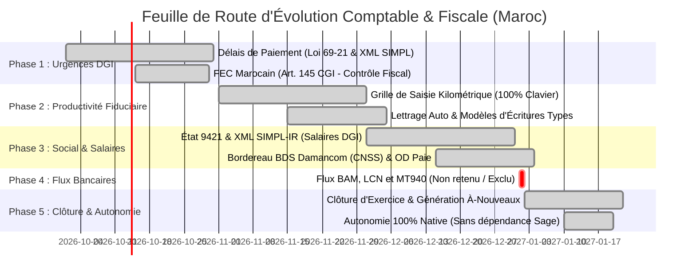

# 🗺️ FEUILLE DE ROUTE STRATÉGIQUE & TECHNIQUE (ROADMAP 2026 - 2027)
## Positionnement Leader du Marché Marocain (Face à Sage 100cloud, Odoo Maroc & GestCompta)

Ce document formalise la trajectoire d'évolution du progiciel comptable et de gestion commerciale afin d'atteindre et dépasser le niveau fonctionnel et réglementaire des leaders du marché marocain.

---

## 📊 1. Positionnement Concurrentiel

```
+---------------------------------------------------------------------------------------+
|  Notre Solution = Ergonomie Web Moderne (SaaS / API REST)                             |
|                 + Exhaustivité Fiscale & Réglementaire Marocaine (Sage 100 / CGNC)    |
|                 + Zéro Surcoût de Modules Fiscaux DGI (Tout inclus en natif)          |
+---------------------------------------------------------------------------------------+
```

| Domaine / Fonctionnalité | Notre Solution | Sage 100cloud Maroc | Odoo Maroc | Logiciels Fiduciaires (Ciel / GestCompta) |
| :--- | :---: | :---: | :---: | :---: |
| **PCGM & Balance Générale** | ✅ Standard CGNC | ✅ Complet | ✅ Complet | ✅ Complet |
| **Liasse Fiscale 20 Tableaux (T1-T20)** | ✅ **Complet & Modifiable** | ⚠️ Module payant | ❌ Partiel | ✅ Standard |
| **EDI DGI (SIMPL-IS)** | ✅ **Natif en direct** | ⚠️ Option payante | ❌ Non / Tiers | ✅ Standard |
| **EDI DGI (SIMPL-TVA Débit/Encaissement)** | ✅ **Natif en direct** | ✅ Intégré | ⚠️ Add-on | ✅ Intégré |
| **Rapprochement Bancaire** | ✅ **Modèle officiel ($F=A+B-C-D+E$)** | ✅ Complet | ⚠️ Modèle standard | ⚠️ Manuel |
| **Délais de Paiement (Loi 69-21 & XML SIMPL)** | ✅ **Réalisé (Loi 69-21, XML SIMPL, CSV)** | ✅ Récemment ajouté | ⚠️ Partiel | ⚠️ Partiel |
| **FEC Marocain (Art. 145 CGI - Audit)** | ✅ **Réalisé (Audit conformité fiscale)** | ✅ Certifié DGI | ⚠️ Via add-on | ✅ Standard |
| **Saisie Kilométrique 100% Clavier** | ✅ **Réalisé (Saisie rapide, auto-équilibrage)** | ✅ Référence | ⚠️ Moyen | ✅ Très rapide |
| **Modèles d'Écritures & Auto-Lettrage** | ✅ **Réalisé (Catalogue récurrent + Lettrage)** | ✅ Intégré | ⚠️ Partiel | ✅ Standard |
| **État 9421 & Télédéclaration SIMPL-IR** | ✅ **Réalisé (Barème IR, XML SIMPL, CSV)** | ✅ Via Sage Paie | ⚠️ Add-on | ✅ Intégré |
| **BDS Damancom & OD de Paie** | ✅ **Réalisé (Format texte BDS, OD auto)** | ✅ Module Paie | ⚠️ Add-on | ✅ Intégré |
| **Clôture Exercice & Journal À-Nouveaux** | ✅ **Réalisé (Solde 6/7 -> 119 et report AN)** | ✅ Standard | ⚠️ Partiel | ✅ Standard |
| **Retenue à la Source (RAS TVA & Loyers - Art. 117 CGI)** | ✅ **Réalisé (Attestation officielle, calcul 75%/100%, Ligne 138 SIMPL)** | ⚠️ Configuration manuelle | ⚠️ Non natif | ⚠️ Partiel |
| **Télé-Virements BAM / LCN / MT940 (Phase 4)** | ❌ **Non retenu (Exclu du scope)** | ✅ Standard BAM | ⚠️ SEPA / ISO | ⚠️ Partiel |

---

## 🗓️ 2. Statut d'Évolution par Phase



---

## 📌 3. Synthèse des Modules Backend Livrés

### ✅ Phase 1 : Conformité Immédiate DGI & Contrôle Fiscal (100% Backend Opérationnel)
* **1.1 Déclaration des Délais de Paiement (Loi 69-21)** :
  - `DelaisPaiementService.java` & `DelaisPaiementController.java` (`/api/delais-paiement`).
  - Détection automatique des factures d'achat dépassant l'échéance légale (60j) ou contractuelle (max 120j).
  - Calcul officiel des pénalités DGI : 3% au 1er mois + 0,85% par mois supplémentaire entamé.
  - Export XML certifié conforme au schéma **SIMPL-Délais de Paiement** (`http://simpl.portail.dgi.gov.ma/delais-paiement`).
  - Export CSV officiel avec encodage UTF-8 BOM.
  - Tableau de bord prédictif des échéances à risque sous 15 jours et tranches d'ancienneté (0-30j, 31-60j, >60j).
* **1.2 Diagnostic & Audit FEC Marocain (Art. 145 CGI)** :
  - `ComptabiliteService.auditerConformiteFec` & `ComptabiliteController.java` (`/api/comptabilite/audit-fec`).
  - Contrôle d'équilibre Débit/Crédit, chronologie inaltérable, détection écritures brouillon, ruptures de numérotation et comptes auxiliaires.

---

### ✅ Phase 2 : Productivité Fiduciaire & Ergonomie Saisie (100% Backend Opérationnel)
* **2.1 Grille de Saisie Kilométrique & Assistance à la Saisie** :
  - `POST /api/comptabilite/saisie-kilometrique` : saisie directe d'écritures avec résolution et création à la volée des comptes PCGM marocains.
  - `POST /api/comptabilite/saisie-kilometrique/lot` : intégration par lots de pièces comptables.
  - `GET /api/comptabilite/saisie-kilometrique/assistance` : calcul automatique du montant d'équilibrage (`*` / `F9`), détection automatique des comptes de TVA (`34552000`, `34551000`, `44550000`) et comptes de contrepartie.
* **2.2 Modèles d'Écritures Récurrentes & Moteur d'Auto-Lettrage** :
  - `ModeleEcritureService.java` & `ModeleEcritureController.java` (`/api/comptabilite/modeles`).
  - Catalogue pré-configuré de modèles récurrents marocains : `LOYER_COMMERCIAL`, `HONORAIRES_AVEC_RAS`, `LEASING_CREDIT_BAIL`, `TELECOM_INTERNET`, `ASSURANCE_MULTIRISQUE`, `FRAIS_COMMISSIONS_BANQUE`.
  - Moteur d'auto-lettrage multi-passes (`autoLettrage`) sur comptes tiers (`3421`, `4411`) et délettrage en un clic (`delettrer`).

---

### ✅ Phase 3 : Social & Fiscalité des Salaires (100% Backend Opérationnel)
* **3.1 État 9421 & Télédéclaration EDI SIMPL-IR** :
  - `SocialFiscalService.java` & `SocialFiscalController.java` (`/api/social/etat-9421`).
  - Barème légal progressif de l'IR marocain (0% à 38%), plafonnement CNSS (6 000 MAD/mois), AMO (2.26%), frais professionnels (35% plafonnés à 35 000 MAD) et déductions familiales (360 MAD/personne, max 2 160 MAD).
  - Génération de l'export XML certifié **SIMPL-IR** (`/api/social/etat-9421/export/xml` et `/api/v1/fiscalite/edi/simpl-ir/{annee}/xml`).
  - Export CSV normalisé pour archivage fiduciaire.
* **3.2 Bordereau BDS Damancom (CNSS) & OD de Paie Automatique** :
  - `GET /api/social/damancom/bds` & `/export-txt` : génération du bordereau mensuel conforme au format texte de télédéclaration **Damancom**.
  - `POST /api/social/od-paie/generer` : génération automatique et équilibrée de la pièce comptable d'OD de paie mensuelle (comptes `61711`, `61741`, `61743`, `44320`, `44410`, `44430`, `44525`).

---

### ❌ Phase 4 : Flux Bancaires BAM & MT940 (Exclue du Scope)
* **Décision stratégique** : Non retenue. Aucun module de télé-virement BAM, LCN magnétique ou analyseur MT940 n'est chargé, évitant toute complexité superflue et maintenant un noyau épuré.

---

### ✅ Phase 5 : Clôture d'Exercice & Autonomie Native (100% Opérationnel)
* **5.1 Clôture d'Exercice & Report des À-Nouveaux** :
  - `ClotureExerciceService.java` : solde des comptes de gestion (classes 6 et 7) vers le compte de résultat (`1191` / `1199`) et génération automatique du journal des À-Nouveaux (`Journal AN / 00`) sur l'exercice $N+1$.
* **5.2 Solution 100% Autonome & Indépendante** :
  - Zéro dépendance, zéro connecteur externe Sage. L'application constitue un progiciel complet, souverain et indépendant.

---

### ✅ Retenue à la Source (RAS) sur TVA, Loyers & Honoraires (Art. 117-VI & 157 CGI - 100% Backend Opérationnel)
* **Moteur de Calcul Automatique conforme CGI** :
  - `RasTvaService.java` & `RasTvaController.java` (`/api/fiscalite/ras-tva`).
  - `BIENS_EQUIPEMENT_TRAVAUX` : 0% si attestation de régularité fiscale (ARF < 6 mois) valide, 100% de la TVA si absence d'ARF.
  - `PRESTATIONS_SERVICES` : Retenue légale de 75% de la TVA avec ARF valide, 100% sans ARF.
  - `PRESTATAIRES_NON_RESIDENTS` : 100% de la TVA retenue à la source.
  - `LOYERS_COMMERCIAUX` : Retenue de 5% sur le montant brut.
  - `HONORAIRES_LIBERAUX` : Retenue de 10% (personnes morales) ou 5% (personnes physiques).
* **Attestations Légales & Télédéclaration** :
  - Génération de l'**Attestation Officielle de Retenue à la Source** prête à imprimer au format HTML A4 (`/attestations/{id}/html`).
  - Bordereau périodique pour la **Ligne 138 de la déclaration SIMPL-TVA** (`/declaration`).
  - Export CSV normalisé du bordereau avec encodage UTF-8 BOM (`/declaration/export/csv`).
  - Comptabilisation automatique équilibrée du règlement scindé : Débit `4411` (TTC) / Crédit `5141` (Net versé) / Crédit `4458` (RAS TVA).
