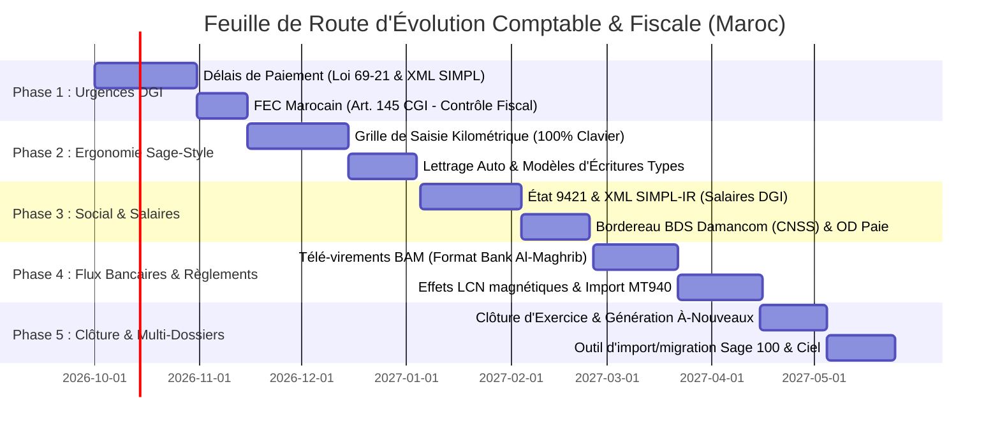

# 🗺️ FEUILLE DE ROUTE STRATÉGIQUE & TECHNIQUE (ROADMAP 2026 - 2027)
## Positionnement Leader du Marché Marocain (Face à Sage 100cloud, Odoo Maroc & GestCompta)

Ce document formalise la trajectoire d'évolution du progiciel comptable et de gestion commerciale afin d'atteindre et dépasser le niveau fonctionnel et réglementaire des leaders du marché marocain.

---

## 📊 1. Positionnement Concurrentiel

```
+---------------------------------------------------------------------------------------+
|  Notre Solution = Ergonomie Web Moderne (SaaS / API REST)                             |
|                 + Exhaustivité Fiscale & Réglementaire Marocaine (Sage 100 / CGNC)    |
|                 + Zéro Surcoût de Modules Fiscaux DGI (Tout inclus en natif)          |
+---------------------------------------------------------------------------------------+
```

| Domaine / Fonctionnalité | Notre Solution | Sage 100cloud Maroc | Odoo Maroc | Logiciels Fiduciaires (Ciel / GestCompta) |
| :--- | :---: | :---: | :---: | :---: |
| **PCGM & Balance Générale** | ✅ Standard CGNC | ✅ Complet | ✅ Complet | ✅ Complet |
| **Liasse Fiscale 20 Tableaux (T1-T20)** | ✅ **Complet & Modifiable** | ⚠️ Module payant | ❌ Partiel | ✅ Standard |
| **EDI DGI (SIMPL-IS)** | ✅ **Natif en direct** | ⚠️ Option payante | ❌ Non / Tiers | ✅ Standard |
| **EDI DGI (SIMPL-TVA Débit/Encaissement)** | ✅ **Natif en direct** | ✅ Intégré | ⚠️ Add-on | ✅ Intégré |
| **Rapprochement Bancaire** | ✅ **Modèle Excel officiel ($F=A+B-C-D+E$)** | ✅ Complet | ⚠️ Modèle standard | ⚠️ Manuel |
| **Délais de Paiement (Loi 69-21)** | 🎯 *Phase 1 (En attente)* | ✅ Récemment ajouté | ⚠️ Partiel | ⚠️ Partiel |
| **FEC Marocain (Art. 145 CGI - Contrôle)** | 🎯 *Phase 1 (En attente)* | ✅ Certifié DGI | ⚠️ Via add-on | ✅ Standard |
| **Saisie Kilométrique 100% Clavier** | 🎯 *Phase 2 (En attente)* | ✅ Référence | ⚠️ Moyen | ✅ Très rapide |
| **État 9421 & Télédéclaration IR/CNSS** | 🎯 *Phase 3 (En attente)* | ✅ Via Sage Paie | ⚠️ Add-on | ✅ Intégré |
| **Télé-Virements Bancaires BAM** | 🎯 *Phase 4 (En attente)* | ✅ Standard BAM | ⚠️ SEPA / ISO | ⚠️ Partiel |

---

## 🗓️ 2. Calendrier d'Évolution (Phases)



---

## 📌 3. Détail des Modules Prévus

### 🚀 Phase 1 : Conformité Immédiate DGI & Contrôle Fiscal
* **1.1 Déclaration des Délais de Paiement (Loi 69-21)** :
  - Suivi des factures fournisseurs et clients dépassant les 60 jours légaux (ou 120 jours contractuels).
  - Calcul automatique des amendes DGI (3% au 1er mois + 0,85% par mois supplémentaire).
  - Génération de l'export XML normalisé pour télédéclaration sur le portail **SIMPL-Délais de Paiement**.
* **1.2 Fichier des Écritures Comptables (FEC Marocain - Art. 145 CGI)** :
  - Export certifié inaltérable et séquentiel de l'intégralité du journal général et auxiliaire pour vérification fiscale.

---

### ⚡ Phase 2 : Productivité Fiduciaire & Expérience "Style Sage"
* **2.1 Grille de Saisie Kilométrique Ultra-Rapide (100% Clavier)** :
  - Navigation par touches `Tab` / `Entrée`.
  - Auto-équilibrage sur la dernière ligne avec touche dédiée (`*` ou `F9`).
  - Détection automatique du compte de contrepartie et de TVA selon le journal.
* **2.2 Modèles d'écritures récurrentes & Lettrage automatique** :
  - Abonnements types (loyers, assurances, leasings).
  - Lettrage automatique des comptes clients `3421` et fournisseurs `4411` par référence pièce et montant.

---

### 👥 Phase 3 : Social & Fiscalité des Salaires
* **3.1 État 9421 (ex-État 9000 - Déclaration Annuelle des Salaires)** :
  - Tableau nominatif des rémunérations annuelles, indemnités et retenues IR.
  - Export XML EDI certifié pour télédéclaration **SIMPL-IR**.
* **3.2 Télédéclaration CNSS Damancom (BDS) & Écritures d'OD de Paie** :
  - Génération du fichier bordereau BDS au format Damancom.
  - Génération automatique des écritures comptables mensuelles de paie (comptes 6171, 6174, 4432, 4441, 44525).

---

### 💳 Phase 4 : Flux Bancaires & Règlements (Normes BAM)
* **4.1 Télé-Virements Bancaires Nationaux (Format Bank Al-Maghrib)** :
  - Génération du fichier de télé-virement de masse (format texte normalisé BAM à 120/160 caractères ou XML ISO 20022).
  - Validation automatique du RIB marocain (24 chiffres avec contrôle Modulo 97).
  - Compatibilité assurée avec toutes les plateformes de Cash Management marocaines (Attijari, BCP, BMCE, CIH, SGMB).
* **4.2 Effets de commerce (LCN) & Formats bancaires internationaux** :
  - Émission de la Lettre de Change Normalisée (LCN magnétique) pour encaissement bancaire.
  - Support de l'import direct des relevés aux formats **MT940** et **CAMT.053**.

---

### 📂 Phase 5 : Automatisation Fiduciaire & Clôture d'Exercice
* **5.1 Assistant de Clôture d'Exercice & Report des À-Nouveaux** :
  - Solde automatique des comptes de gestion (classes 6 et 7) vers le compte de résultat `1191` ou `1199`.
  - Génération automatique du journal des à-nouveaux (Journal 00) avec report exact des soldes des classes 1 à 5 sur l'exercice $N+1$.
* **5.2 Passerelle de Migration Universelle (Sage 100 / Ciel / GestCompta)** :
  - Import direct des balances et grands livres d'anciens logiciels pour faciliter la transition client.
